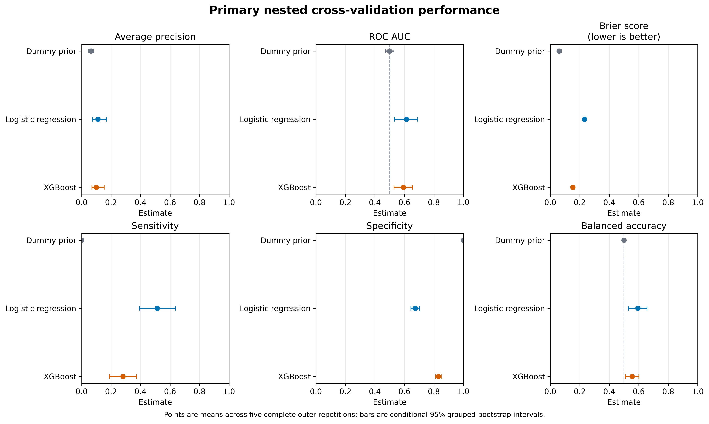
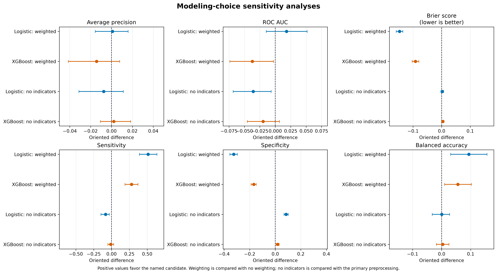

# Reproducible Cervical Biopsy Modeling

[](https://github.com/Gaith2000korchid/reproducible-cervical-biopsy-modeling/actions/workflows/ci.yml)

[Présentation française](docs/PRESENTATION_FR.md) · [Complete reproduction](docs/reproduction.md)

Leakage-aware prediction of concurrent cervical biopsy positivity using
reproducible preprocessing and nested, group-aware cross-validation.

> This repository is an educational and methodological portfolio project.
> The models are not intended for diagnosis, clinical decision-making, or
> patient care.

## Overview

This project evaluates whether demographic, behavioral, reproductive, and
medical-history variables available before the current cervical examination
can discriminate between positive and negative biopsy outcomes.

The analysis deliberately excludes current diagnostic examination results from
the primary predictor set. It also evaluates how duplicate observations, class
weighting, missingness indicators, and diagnostic-variable leakage affect the
results.

## Main findings

The dataset contained 858 observations, including 55 biopsy-positive outcomes
(6.4%) and 831 exact-predictor groups.

| Model | Average precision | ROC AUC | Sensitivity | Specificity | Balanced accuracy |
|---|---:|---:|---:|---:|---:|
| Dummy prior | 0.0640 | 0.4993 | 0.0000 | 1.0000 | 0.5000 |
| Logistic regression | 0.1101 | 0.6133 | 0.5127 | 0.6740 | 0.5933 |
| XGBoost | 0.0993 | 0.5932 | 0.2800 | 0.8299 | 0.5549 |

Both fitted models improved average precision and ROC AUC relative to the dummy
classifier. Paired intervals did not identify a clear overall winner between
logistic regression and XGBoost.

At the fixed threshold of 0.5, logistic regression was more sensitive, whereas
XGBoost was more specific. Performance remained modest, and the weighted-model
probabilities should not be interpreted as calibrated clinical risks.



Detailed numerical results, conditional uncertainty intervals, sensitivity
analyses, and limitations are reported in
[`docs/results.md`](docs/results.md).

## Validation design

The primary workflow uses:

- five outer folds repeated five times;
- stratified, group-aware splitting;
- four-fold inner validation for hyperparameter selection;
- preprocessing fitted exclusively on training data;
- exact-predictor grouping to prevent identical profiles from crossing folds;
- an empirical-prevalence dummy classifier;
- class-weighted logistic regression;
- class-weighted XGBoost;
- average precision as the primary metric;
- grouped bootstrap intervals based on 2,000 resamples.

The full prespecified design is documented in
[`docs/modeling_protocol.md`](docs/modeling_protocol.md).

## Sensitivity analyses

Four separate analyses assess the robustness of the primary conclusions:

1. retaining one observation per exact-predictor group;
2. removing class weighting;
3. including current diagnostic variables as an explicit leakage audit;
4. removing missingness-indicator features.

The duplicate-removal analysis produced similar conclusions. Class weighting
substantially changed sensitivity and specificity. Missingness indicators had a
modest influence overall, with clearer effects for logistic regression.

The diagnostic-inclusive audit produced very large apparent performance gains.
Those values are not valid pre-screening estimates; they demonstrate the
inflation caused by diagnostic-variable leakage.



## Dataset

The project uses the public
[Cervical Cancer (Risk Factors)](https://doi.org/10.24432/C5Z310)
dataset from the UCI Machine Learning Repository:

- 858 observations;
- 36 original variables;
- binary `Biopsy` outcome;
- missing values;
- CC BY 4.0 license.

Raw and processed datasets are not committed. Data provenance and retrieval
details are documented in [`data/README.md`](data/README.md).

## Repository structure

```text
.
├── data/                         # Data provenance and local generated data
├── docs/
│   ├── modeling_protocol.md      # Prespecified analysis protocol
│   └── results.md                # Results and scientific interpretation
├── reports/
│   ├── figures/                  # Reproducible result figures
│   └── sensitivity_*/            # Sensitivity-analysis tables
├── src/
│   └── cervical_biopsy_modeling/ # Reusable analysis package
├── tests/                        # Automated tests
├── pyproject.toml
├── uv.lock
└── README.md
```

## Installation

The project requires Python 3.13 and uses
[`uv`](https://docs.astral.sh/uv/) for dependency management.

```bash
git clone https://github.com/Gaith2000korchid/reproducible-cervical-biopsy-modeling.git
cd reproducible-cervical-biopsy-modeling
uv sync --frozen
```

XGBoost requires the OpenMP runtime. On macOS with Homebrew:

```bash
brew install libomp
```

## Tests

On macOS:

```bash
DYLD_LIBRARY_PATH="$(brew --prefix libomp)/lib" \
  uv run pytest
```

The automated suite includes the original 120 tests plus a regression protecting published results from accidental overwrite. GitHub Actions installs the frozen environment, runs the suite with coverage, and regenerates figures from published tables in a separate directory. This does not refit the models or validate clinical utility.

## Reproducing the figures

The committed numerical result tables can be used to regenerate all final
figures without refitting the models:

```bash
uv run python -m cervical_biopsy_modeling.reporting
```

This creates:

- `reports/figures/primary_performance.png`;
- `reports/figures/duplicate_sensitivity.png`;
- `reports/figures/modeling_sensitivity_comparisons.png`;
- `reports/figures/diagnostic_leakage_audit.png`.

To refit the primary models and all four sensitivity analyses without overwriting published evidence:

```bash
uv run --frozen python -m cervical_biopsy_modeling.reproduce --mode full --output-dir artifacts/full-rerun
```

The output directory must be empty. It receives result tables, figures, module logs and a run record with code, data and result fingerprints. `--mode primary` runs only the primary evaluation; `--mode figures` reuses the published tables. Full refits and bootstrap summaries can take substantial time; use the manual workflow option to run the full analysis in GitHub Actions. See [reproduction instructions](docs/reproduction.md). A full Linux refit of commit `41266a77` is summarized in [the validation note](docs/full_reproduction_validation.md); published tables were kept.

## Reproducibility safeguards

The repository includes:

- pinned dependencies in `uv.lock`;
- fixed random seeds;
- training-fold-only preprocessing;
- group-aware nested validation;
- automated tests;
- committed out-of-fold predictions and result tables;
- deterministic figure generation;
- documented data provenance and methodological limitations.

## Project origin

The topic was initially explored through a Coursera Guided Project. This
repository is a new implementation with an original scientific question,
original code, leakage controls, nested validation, uncertainty estimation,
testing, and reproducibility safeguards.

No Coursera source code or course notebook is included.

## License

Project code is released under the MIT License.

The UCI dataset remains governed by its CC BY 4.0 license and must be cited
separately.
