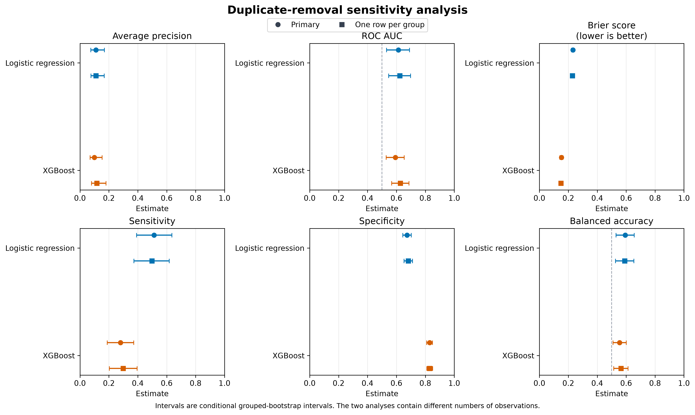
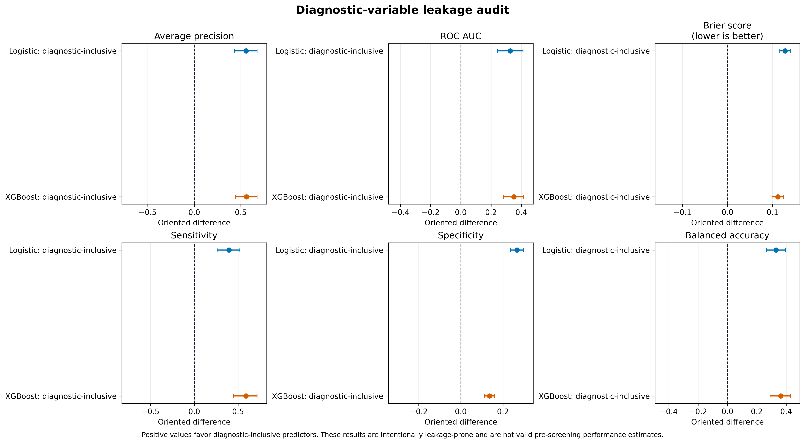

# Results

## Scope

This project evaluates how well information available before the current
cervical diagnostic examination discriminates between positive and negative
concurrent biopsy outcomes.

The results represent internal validation on one public cross-sectional
dataset. They are not estimates of future cervical cancer risk and are not
intended for clinical decision-making.

## Analysis population

The validated dataset contained:

- 858 observations;
- 55 biopsy-positive observations (6.4%);
- 803 biopsy-negative observations;
- 831 exact-predictor groups;
- 28 leakage-aware primary predictors.

Exact duplicate predictor profiles were assigned to the same validation fold.

## Validation design

The primary analysis used:

- five outer folds repeated five times;
- stratified, group-aware outer splitting;
- four-fold inner validation for hyperparameter selection;
- preprocessing fitted only on training data;
- a fixed classification threshold of 0.5;
- an empirical-prevalence dummy classifier;
- class-weighted logistic regression;
- class-weighted XGBoost;
- 2,000 grouped-bootstrap resamples for conditional 95% intervals.

Point estimates were calculated within each complete outer repetition by
pooling all out-of-fold predictions, then averaging across the five
repetitions.

The bootstrap intervals are conditional on the observed out-of-fold
predictions. They are not external-validation confidence intervals and do not
represent every source of model-training uncertainty.

## Primary performance

Values are repetition means with conditional 95% grouped-bootstrap intervals.

| Metric | Dummy prior | Logistic regression | XGBoost |
|---|---:|---:|---:|
| Average precision | 0.0640 (0.0475–0.0825) | 0.1101 (0.0750–0.1692) | 0.0993 (0.0704–0.1535) |
| ROC AUC | 0.4993 (0.4708–0.5293) | 0.6133 (0.5322–0.6900) | 0.5932 (0.5293–0.6545) |
| Brier score | 0.0600 (0.0458–0.0752) | 0.2317 (0.2224–0.2409) | 0.1522 (0.1420–0.1629) |
| Sensitivity | 0.0000 (0.0000–0.0000) | 0.5127 (0.3918–0.6364) | 0.2800 (0.1882–0.3719) |
| Specificity | 1.0000 (1.0000–1.0000) | 0.6740 (0.6437–0.7023) | 0.8299 (0.8092–0.8496) |
| Balanced accuracy | 0.5000 (0.5000–0.5000) | 0.5933 (0.5305–0.6558) | 0.5549 (0.5089–0.6013) |


Both fitted models improved average precision and ROC AUC relative to the
dummy classifier. Their paired intervals against the dummy classifier excluded
zero for average precision, ROC AUC, and balanced accuracy.

The paired logistic-regression-versus-XGBoost intervals included zero for
average precision, ROC AUC, and balanced accuracy. The data therefore did not
identify a clear overall winner between the two fitted models on these
metrics.

At the fixed threshold of 0.5, logistic regression was more sensitive than
XGBoost, whereas XGBoost was more specific. Positive predictive value remained
low for both models because biopsy positivity was uncommon:

- logistic regression: 0.0973;
- XGBoost: 0.1011.

The corresponding F1 scores were 0.1635 and 0.1476.

The dummy classifier obtained the lowest Brier score by predicting a
probability close to the low outcome prevalence. The class-weighted fitted
models produced poorer probabilistic accuracy, especially logistic regression.
Their predicted probabilities must not be interpreted as calibrated clinical
risks.

## Primary paired comparisons

Differences were oriented so that positive values always favor the candidate
model. For the Brier score, the calculation was therefore reference minus
candidate because lower values are preferable.

| Candidate versus reference | Average precision | ROC AUC | Balanced accuracy |
|---|---:|---:|---:|
| Logistic versus dummy | +0.0461 (0.0183–0.0994) | +0.1141 (0.0321–0.1938) | +0.0933 (0.0305–0.1558) |
| XGBoost versus dummy | +0.0353 (0.0140–0.0855) | +0.0939 (0.0232–0.1602) | +0.0549 (0.0089–0.1013) |
| Logistic versus XGBoost | +0.0108 (-0.0296–0.0561) | +0.0202 (-0.0604–0.1041) | +0.0384 (-0.0172–0.1026) |

Intervals excluding zero describe conditional paired differences in the
observed out-of-fold predictions. They should not be interpreted as universal
claims of superiority.

## Sensitivity analyses

### Duplicate removal

After retaining the first observation from each exact-predictor group, 831
observations remained, including 53 biopsy-positive observations.

The main conclusions were stable:

| Model and metric | Primary | One observation per group |
|---|---:|---:|
| Logistic average precision | 0.1101 | 0.1104 |
| Logistic ROC AUC | 0.6133 | 0.6234 |
| Logistic balanced accuracy | 0.5933 | 0.5903 |
| XGBoost average precision | 0.0993 | 0.1170 |
| XGBoost ROC AUC | 0.5932 | 0.6274 |
| XGBoost balanced accuracy | 0.5549 | 0.5642 |

Because the two analyses contain different observations, these descriptive
changes were not treated as a directly paired comparison.



### Class weighting

Class weighting changed threshold-dependent behavior much more than ranking
performance.

For logistic regression, weighting increased sensitivity by 0.5127 and
balanced accuracy by 0.0938, while decreasing specificity by 0.3250. Its paired
differences for average precision and ROC AUC included zero.

For XGBoost, weighting increased sensitivity by 0.2800 and balanced accuracy by
0.0561, while decreasing specificity by 0.1679. Weighted XGBoost had a lower
ROC AUC than unweighted XGBoost in this analysis.

Weighting worsened the Brier score for both model families. It should therefore
be understood as a strategy for changing the classification operating point,
not as evidence that the resulting probabilities estimate calibrated risk.

### Missingness indicators

Removing missingness-indicator features produced modest changes overall.

For logistic regression, removing indicators:

- reduced ROC AUC by 0.0358, with an interval excluding zero;
- reduced sensitivity by 0.0836, with an interval excluding zero;
- increased specificity by 0.0849, with an interval excluding zero;
- did not produce a clear paired change in average precision or balanced
  accuracy.

For XGBoost, most paired intervals included zero. The specificity difference of
+0.0184 favored the model without indicators.

These results support retaining the prespecified indicators in the primary
analysis, particularly for logistic-regression discrimination and sensitivity,
while showing that XGBoost was comparatively robust to this preprocessing
choice.


### Diagnostic-variable leakage audit

The leakage audit intentionally added current diagnostic variables excluded
from the primary predictor set:

- `Hinselmann`;
- `Schiller`;
- `Citology`;
- `Dx:Cancer`;
- `Dx:CIN`;
- `Dx:HPV`;
- `Dx`.

This produced very large apparent improvements:

| Model and metric | Primary | Diagnostic-inclusive |
|---|---:|---:|
| Logistic average precision | 0.1101 | 0.6660 |
| Logistic ROC AUC | 0.6133 | 0.9406 |
| Logistic balanced accuracy | 0.5933 | 0.9248 |
| XGBoost average precision | 0.0993 | 0.6599 |
| XGBoost ROC AUC | 0.5932 | 0.9437 |
| XGBoost balanced accuracy | 0.5549 | 0.9174 |

All displayed paired diagnostic-versus-primary intervals excluded zero.

These results are not valid pre-screening performance estimates. They
demonstrate how including information collected during the current diagnostic
work-up can produce severely inflated estimates.



## Overall interpretation

The leakage-aware predictors contained some discriminatory information beyond
outcome prevalence, but performance remained modest and uncertain.

Logistic regression and XGBoost offered different threshold trade-offs rather
than a decisive overall winner. Logistic regression identified more positive
cases at the fixed threshold, while XGBoost produced fewer false-positive
classifications.

The analyses also show why methodological design matters:

- duplicate grouping prevented identical profiles from crossing validation
  boundaries;
- class weighting substantially changed sensitivity and specificity;
- missingness indicators affected logistic-regression behavior;
- diagnostic-variable leakage greatly inflated apparent performance.

## Limitations

Important limitations include:

- only 55 biopsy-positive observations;
- one public cross-sectional dataset;
- no reliable patient identifier;
- exact-predictor groups used as a proxy for duplicate subjects;
- no external validation cohort;
- fixed threshold of 0.5 without clinical utility optimization;
- conditional uncertainty intervals based on fixed out-of-fold predictions;
- no claim of causal or future-risk prediction;
- weighted probabilities not established as calibrated clinical risks.

## Reproducible outputs

The complete numerical results are available under `reports/`, including:

- outer-fold metrics;
- out-of-fold predictions;
- selected hyperparameters;
- inner-validation candidates;
- repetition-level metrics;
- grouped-bootstrap summaries;
- paired model comparisons;
- all four sensitivity analyses.

The final figures can be regenerated without refitting the models:

```bash
uv run python -m cervical_biopsy_modeling.reporting
```

The full prespecified design is documented in the
[modeling protocol](modeling_protocol.md).
